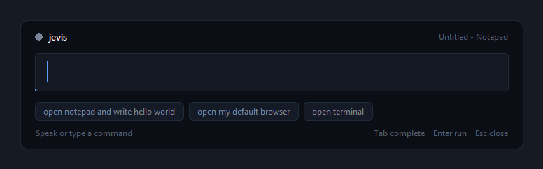

# jevis

A voice-driven desktop agent for Windows that reads the UI Automation tree
instead of pixels.

Say "open notepad and write hello world" and it does it, in about three
seconds, without a vision model and — for the commands you use most — without
any model at all.



## Why no vision model

Windows already publishes every control's role, name, bounds and available
actions through UI Automation. That is ground truth and it is free to read. A
screenshot costs ~1500 tokens and then needs a model to guess at what the tree
would have told you exactly.

Vision is the fallback for surfaces that expose nothing — canvas apps, games —
not the primary sense.

This started out planning to use SAM 3. That was dropped: SAM 3 does promptable
segmentation, which is not GUI grounding. If vision gets added later,
OmniParser is the right tool.

## Reliability

Three tiers, and only the first is trustworthy:

| Tier | Path | Measured |
|---|---|---|
| **Deterministic** | regex → fixed tool sequence → postcondition checked. No model. | **32/32 (100%)**, mean 3.38s, slowest 3.44s |
| Model-planned | Jev routes, a small model plans, same verification, replans once on failure | not guaranteed |
| Refused | Jev classified it unsafe, or no allowed app matches. Nothing runs. | — |

A free-form LLM planner cannot be 100%. It will eventually emit a wrong step.
The deterministic tier exists so the commands you say every day never reach a
model — and the bar tells you which tier you are on *before* you press Enter.


Adding a phrase to `jevis/skills.py` moves it into the deterministic tier
permanently.

```bash
JEVIS_ITERATIONS=8 ./.venv/Scripts/python.exe tests/test_reliability.py
```

## Verification, not optimism

Every step carries conditions that are checked against the real UI:

- **`expect`** runs after the action. Did the text actually land? Is the title
  still marked unsaved?
- **`require`** runs *before* it. Is this editor empty before we type into it?

The precondition is the one that matters. `launch("notepad")` on an already
running Notepad hands back whatever tab is currently open — which may hold your
unsaved work. jevis opens a fresh tab first, and refuses to type into a
non-empty editor even if it somehow gets there:

```
planted: 'IMPORTANT USER WORK'
refused -> expected an empty editor, found 'IMPORTANT USER WORK'
content intact: 'IMPORTANT USER WORK'
```

## The model split

| Job | Model | Why |
|---|---|---|
| Route the instruction | Jev (`api.typesafe.ai/v1/systemone`) | Returns a typed choice with a probability distribution. No prose to parse. |
| Judge the outcome | Jev | Same primitive, applied to observed UI state. |
| Plan tool calls | `nvidia/nemotron-3.5-lightning-30b-a3b` | 3B active params, sub-second first token. |
| Compose body text | same | Only runs when the router says text is needed. |

A literal instruction costs zero model calls. A generative one costs one Jev
classification and one small-model call.

## Apps it can open

`notepad`, `browser` (whatever is registered for https), `terminal`, `calc`,
`mspaint`, `explorer` — detected at import in `jevis/apps.py`, so an app that
is not installed is reported missing rather than silently swapped for another.

Windows are matched on the **owning process**, never on window class.
`Chrome_WidgetWin_1` is Chrome, Edge, and every Electron app on the machine;
class matching would let "open my browser" adopt an unrelated window and type
into it.

Only `notepad` is marked typable. A terminal executes what it receives, so
`type_text` into one is refused when the plan is built.

Asking for an app that is not in the registry fails and says what *is*
available. It never opens something else — that is the worst possible failure
mode, and both the planner prompt and a validation pass guard against it.

## Install

```bash
git clone https://github.com/duc-minh-droid/jevis
cd jevis
python -m venv .venv
./.venv/Scripts/python.exe -m pip install uiautomation pillow keyboard pystray
```

The model tier needs API keys. The deterministic tier does not — skip this and
everything in `jevis/skills.py` still works offline.

```bash
cp .env.example .env    # then fill in JEV_API_KEY and NVIDIA_API_KEY
```

## Use

Double-click `jevis.bat`. It runs in the tray with no console window.

Then from anywhere:

| Key | Does |
|---|---|
| `ctrl+alt+j` | summon the bar, already focused |
| `Tab` | accept the first suggestion |
| `↑` / `↓` | walk back through commands already run |
| `Enter` | run |
| `Esc` | dismiss |

**Voice** works through any dictation tool that types into the focused field —
Wispr Flow, Windows Speech, whatever. Summon the bar, hold your dictation key,
speak, press Enter. jevis needs no microphone access of its own.

The bar captures which window you were in *before* it took focus, so "write
this down" targets that window and not the bar.

One shot from the shell, no UI:

```bash
./.venv/Scripts/python.exe -m jevis.agent "open notepad and write hello world"
```

## Test

```bash
./.venv/Scripts/python.exe tests/test_e2e.py
```

Drives real Notepad: launch, type, save through the File menu, verify the bytes
on disk. It targets a fresh temp file and refuses to write into an editor that
already has content, so it cannot clobber an open unsaved tab.

## The tool surface

`attach`, `launch`, `snapshot`, `click`, `type_text`, `menu`, `key`, plus
`screenshot` on demand. Small models choose correctly from seven options and
fail from thirty.

## Three things that will bite you

**Bind to a window, never to the foreground.** The user keeps working while the
agent runs. `Snapshot` carries its window and every tool acts on that window.
An earlier version re-read the foreground on each call and typed into a
browser address bar.

**Prefer UIA patterns over synthetic keystrokes.** `Invoke` and `SetValue`
target a specific window and ignore focus. `SendKeys` goes wherever focus is.
That is why saving goes through `menu(snap, ["File", "Save"])` rather than
`ctrl+s`. `key()` still exists and is documented as the unsafe path.

**Notepad marks dirty on keystrokes, not on `SetValue`.** The text updates but
the document does not become dirty, so an immediate save can write an empty
file. The File menu route avoids it.

## Layout

```
jevis/
  apps.py      app registry, process identification, default-browser lookup
  tools.py     the tool surface over UI Automation
  skills.py    deterministic phrase → tool sequence handlers
  brain.py     Jev routing/judging, NIM planning/writing
  agent.py     match, act, verify, retry
  ui.py        the command bar and tray icon
scripts/
  capture_docs.py   regenerates docs/ screenshots from the real app
tests/
  test_e2e.py         full chain against real Notepad
  test_reliability.py pass rate across repeated runs
```

## Not done yet

- Six deterministic skills. Everything else falls to the model tier.
- `click` and `attach` exist but the planner schema does not expose them.
- Six apps. Adding one is an entry in `jevis/apps.py`.
- No autostart. Drop a shortcut to `jevis.bat` in `shell:startup`.
- The hotkey is hard-coded; there is no settings UI.
- Windows only. UI Automation has no equivalent here on macOS or Linux.

## License

MIT
