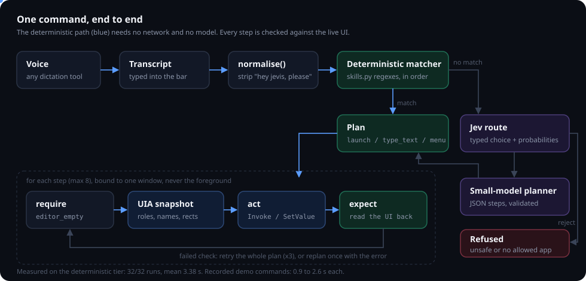
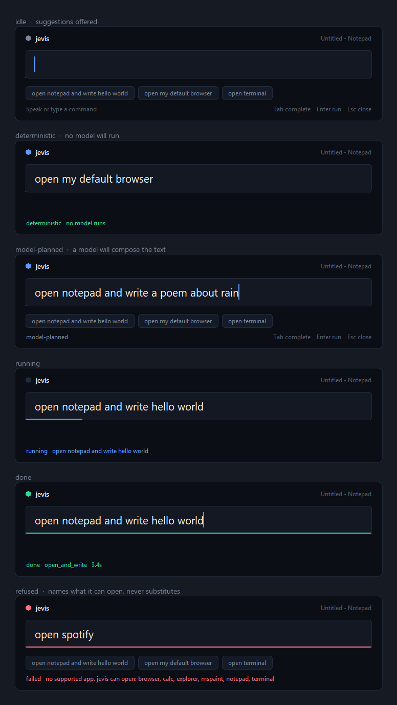
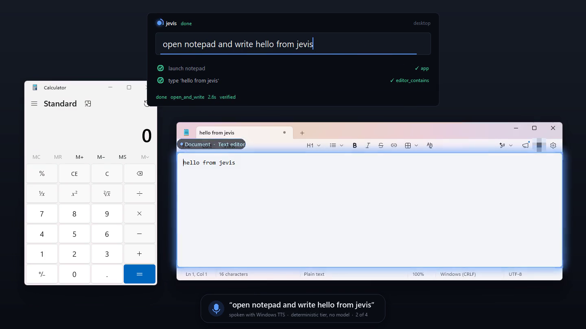
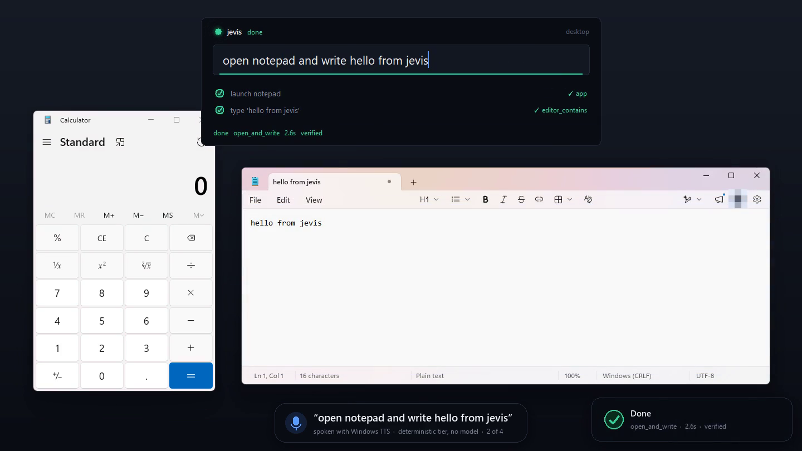
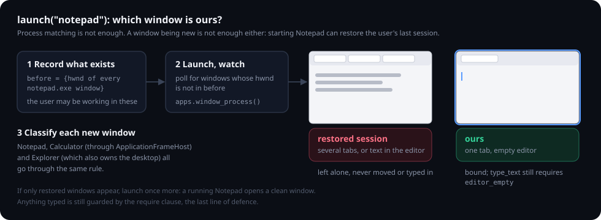
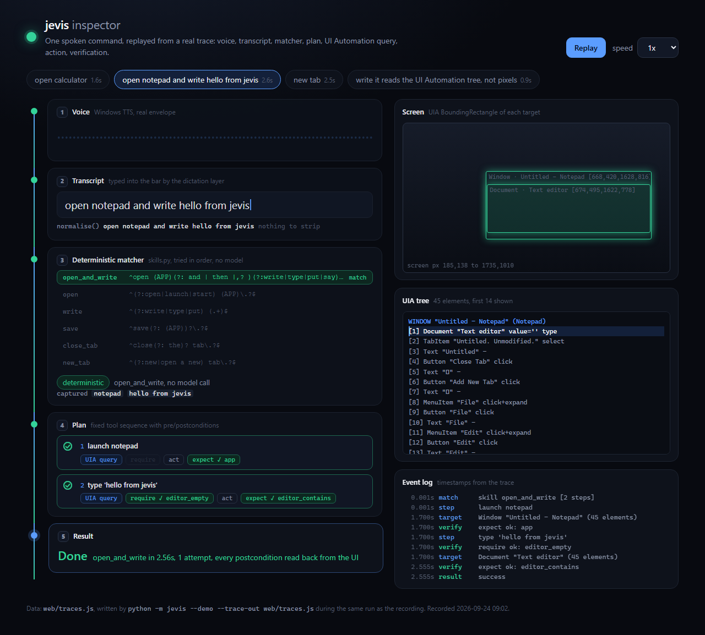

# jevis

**[Trace inspector (live) →](https://jevis-pied.vercel.app)** — replays the recorded demo run step by step.

A voice-driven desktop agent for Windows that reads the UI Automation tree
instead of pixels.


*Four spoken commands, real apps, no model. Each one is spoken with Windows
TTS and captioned at the bottom. The bar shows which tier it matched and ticks
off each step as its postcondition is read back from the UI. The blue outline
is the element being acted on, drawn from its UIA `BoundingRectangle`.
([mp4](docs/media/demo.mp4))*

Say "open notepad and write hello world" and it does it, in about three
seconds, without a vision model and, for the commands you use most, without
any model at all.

## Why no vision model

Windows already publishes every control's role, name, bounds and available
actions through UI Automation. That is ground truth and it is free to read. A
screenshot costs ~1500 tokens and then needs a model to guess at what the tree
would have told you exactly.

Vision is the fallback for surfaces that expose nothing, like canvas apps and
games. It is not the primary sense.

This started out planning to use SAM 3. That was dropped: SAM 3 does promptable
segmentation, which is not GUI grounding. If vision gets added later,
OmniParser is the right tool.

## How a command flows



## Reliability

Three tiers, and only the first is trustworthy:

| Tier | Path | Measured |
|---|---|---|
| **Deterministic** | regex → fixed tool sequence → postcondition checked. No model. | **32/32 (100%)**, mean 3.38s, slowest 3.44s |
| Model-planned | Jev routes, a small model plans, same verification, replans once on failure | not guaranteed |
| Refused | Jev classified it unsafe, or no allowed app matches. Nothing runs. | — |

A free-form LLM planner cannot be 100%. It will eventually emit a wrong step.
The deterministic tier exists so the commands you say every day never reach a
model, and the bar tells you which tier you are on *before* you press Enter.

Adding a phrase to `jevis/skills.py` moves it into the deterministic tier
permanently.

```bash
JEVIS_ITERATIONS=8 ./.venv/Scripts/python.exe tests/test_reliability.py
```

## The bar



It is a frameless Tk window with the background keyed out, so everything you
see is drawn on one Canvas and driven by one 60 fps frame loop:

- **ready**: the orb breathes, suggestions are offered.
- **listening**: the waveform and orb follow the input level. By default that
  level is the cadence of text arriving from your dictation tool, so jevis
  still needs no microphone. `JEVIS_MIC=1` meters the real input device
  instead (needs `sounddevice`).
- **thinking**: a spinner and a travelling underline while a tier is chosen.
- **acting**: the plan unfolds as rows. Each row spins while its step runs and
  draws its check only when the postcondition has been read back.
- **done / failed**: the ring ripples out and a toast slides in bottom right.

The glow around the target and the toast are separate per-pixel-alpha
windows (`jevis/overlay.py`). Pillow renders them once and
`UpdateLayeredWindow` hands them to the compositor. After that a pulse or a
slide changes only the window's alpha or position, so a frame costs one API
call. Both are click-through and never take focus, so they cannot steal input
from the app being driven.

| The target glows, from its UIA rect | Verified, toast confirms |
|---|---|
|  |  |

The worker thread never touches Tk. Agent events (`match`, `step`, `target`,
`verify`) go through a queue and are replayed with a short minimum dwell each,
so a two-step plan does not tick off inside one frame. That dwell paces the
display only. The agent itself is never slowed.

## Verification, not optimism

Every step carries conditions that are checked against the real UI:

- **`expect`** runs after the action. Did the text actually land? Is the title
  still marked unsaved?
- **`require`** runs *before* it. Is this editor empty before we type into it?

The precondition is the one that matters. `launch("notepad")` on an already
running Notepad hands back whatever tab is currently open, which may hold your
unsaved work. jevis opens a fresh document first, and refuses to type into a
non-empty editor even if it somehow gets there:

```
planted: 'IMPORTANT USER WORK'
refused -> expected an empty editor, found 'IMPORTANT USER WORK'
content intact: 'IMPORTANT USER WORK'
```

That check has earned its keep for real. While this demo was being recorded,
Notepad had been closed, and launching it restored the previous session, so
the user's own document came back as a brand-new window. `launch` bound to
it, `require editor_empty` refused, and the retry typed into a clean window.
Nothing was written. `launch` now rules that case out on its own:



## The model split

| Job | Model | Why |
|---|---|---|
| Route the instruction | Jev (`api.typesafe.ai/v1/systemone`) | Returns a typed choice with a probability distribution. No prose to parse. |
| Judge the outcome | Jev | Same primitive, applied to observed UI state. |
| Plan tool calls | `nvidia/nemotron-3.5-lightning-30b-a3b` | 3B active params, sub-second first token. |
| Compose body text | same | Only runs when the router says text is needed. |

A literal instruction costs zero model calls. A generative one costs one Jev
classification and one small-model call.

## Apps it can open

`notepad`, `browser` (whatever is registered for https), `terminal`, `calc`,
`mspaint`, `explorer`. They are detected at import in `jevis/apps.py`, so an
app that is not installed is reported missing rather than silently swapped for
another.

Windows are matched on the **owning process**, never on window class.
`Chrome_WidgetWin_1` is Chrome, Edge, and every Electron app on the machine;
class matching would let "open my browser" adopt an unrelated window and type
into it. Store apps need one more step: Calculator's top-level window belongs
to `ApplicationFrameHost.exe`, so `apps.window_process()` looks through the
frame to the app's own process. Without that, `open calculator` timed out.

Only `notepad` is marked typable. A terminal executes what it receives, so
`type_text` into one is refused when the plan is built.

Asking for an app that is not in the registry fails and says what *is*
available. It never opens something else. That is the worst possible failure
mode, and both the planner prompt and a validation pass guard against it.

## Install

```bash
git clone https://github.com/duc-minh-droid/jevis
cd jevis
python -m venv .venv
./.venv/Scripts/python.exe -m pip install -r requirements.txt
```

The model tier needs API keys. The deterministic tier does not. Skip this and
everything in `jevis/skills.py` still works offline.

```bash
cp .env.example .env    # then fill in JEV_API_KEY and NVIDIA_API_KEY
```

## Use

Double-click `jevis.bat`. It runs in the tray with no console window.

Then from anywhere:

| Key | Does |
|---|---|
| `ctrl+alt+j` | summon the bar, already focused |
| `Tab` | accept the first suggestion |
| `↑` / `↓` | walk back through commands already run |
| `Enter` | run |
| `Esc` | dismiss |

**Voice** works through any dictation tool that types into the focused field,
such as Wispr Flow or Windows Speech. Summon the bar, hold your dictation key,
speak, press Enter.

The bar captures which window you were in *before* it took focus, so "write
this down" targets that window and not the bar.

One shot from the shell, no UI:

```bash
./.venv/Scripts/python.exe -m jevis.agent "open notepad and write hello world"
./.venv/Scripts/python.exe -m jevis.agent --trace "open calculator"   # JSON event stream
```

## Demo and inspector

```bash
./.venv/Scripts/python.exe -m jevis --demo                  # the four commands above
./.venv/Scripts/python.exe -m jevis --demo "open calculator" "open paint"
./.venv/Scripts/python.exe -m jevis --demo --record out.mp4 --trace-out web/traces.js
```

The demo synthesises each command with the built-in Windows voice. Its real
amplitude envelope drives the waveform while the transcript lands, then the
normal bar runs it. `--speak` plays the audio aloud. `--record` needs
`imageio-ffmpeg`. A plain backdrop covers the primary monitor before capture
starts, and afterwards the demo closes only the windows it created, by handle.

`web/index.html` replays the trace from the same run: the voice envelope, the
transcript, the matcher trying each skill regex in order, the plan, every UIA
target's rect on a minimap, the slice of the automation tree the tool surface
saw, and the event timestamps. It is static, so open it with any file server:

```bash
cd web && python -m http.server 8113    # http://127.0.0.1:8113
```



## Test

```bash
./.venv/Scripts/python.exe tests/test_e2e.py
```

This drives real Notepad: launch, type, save through the File menu, verify the
bytes on disk. It targets a fresh temp file and refuses to write into an
editor that already has content, so it cannot clobber an open unsaved tab.

`scripts/capture_docs.py` regenerates `docs/states.png` and `docs/hero.png`
from the real bar.

## The tool surface

`attach`, `launch`, `snapshot`, `click`, `type_text`, `menu`, `key`, plus
`screenshot` on demand. Small models choose correctly from seven options and
fail from thirty.

## Three things that will bite you

**Bind to a window, never to the foreground.** The user keeps working while the
agent runs. `Snapshot` carries its window and every tool acts on that window.
An earlier version re-read the foreground on each call and typed into a
browser address bar.

**Prefer UIA patterns over synthetic keystrokes.** `Invoke` and `SetValue`
target a specific window and ignore focus. `SendKeys` goes wherever focus is.
That is why saving goes through `menu(snap, ["File", "Save"])` rather than
`ctrl+s`. `key()` still exists and is documented as the unsafe path.

**A new window is not necessarily your window.** Starting an app that is not
running can restore the user's last session, and those documents arrive as
fresh windows. Bind to the blank one.

## Layout

```
jevis/
  apps.py      app registry, process identification (incl. Store apps), default-browser lookup
  tools.py     the tool surface over UI Automation
  skills.py    deterministic phrase → tool sequence handlers
  brain.py     Jev routing/judging, NIM planning/writing
  agent.py     match, act, verify, retry; emits the event stream
  ui.py        the command bar, its states and animation, the tray icon
  overlay.py   layered windows: target glow and completion toast
  voice.py     input level sources: typing cadence, mic (opt-in), TTS envelope
  demo.py      scripted TTS-driven run, captions, recording, trace export
web/
  index.html   inspector that replays traces.js
scripts/
  capture_docs.py   regenerates docs/ screenshots from the real app
tests/
  test_e2e.py         full chain against real Notepad
  test_reliability.py pass rate across repeated runs
docs/media/    demo.gif, demo.mp4, screenshots, diagrams
```

## Not done yet

- Six deterministic skills. Everything else falls to the model tier.
- `click` and `attach` exist but the planner schema does not expose them.
- Six apps. Adding one is an entry in `jevis/apps.py`.
- No autostart. Drop a shortcut to `jevis.bat` in `shell:startup`.
- The hotkey is hard-coded; there is no settings UI.
- Windows only. UI Automation has no equivalent here on macOS or Linux.

## License

MIT
